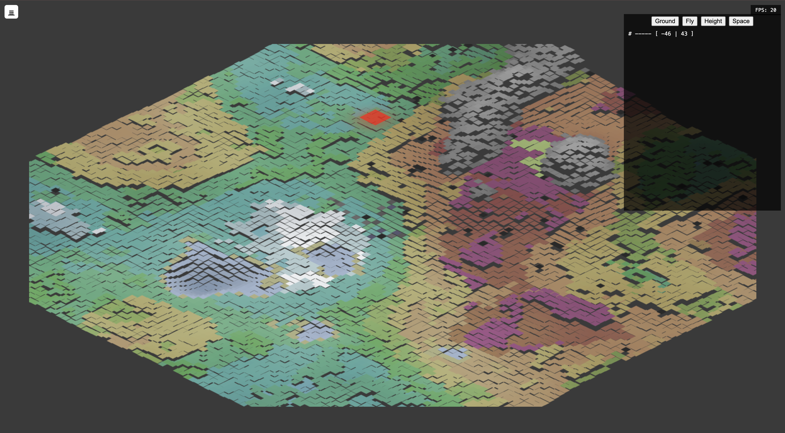
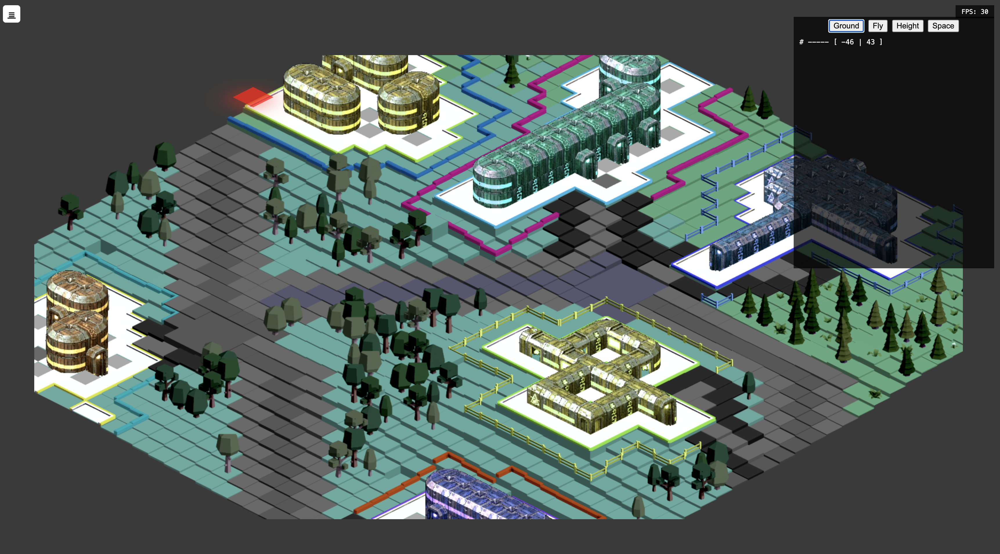
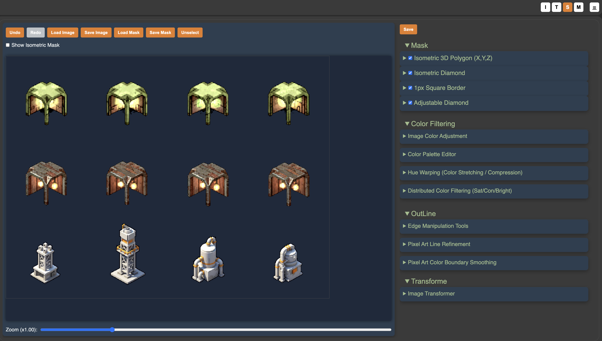
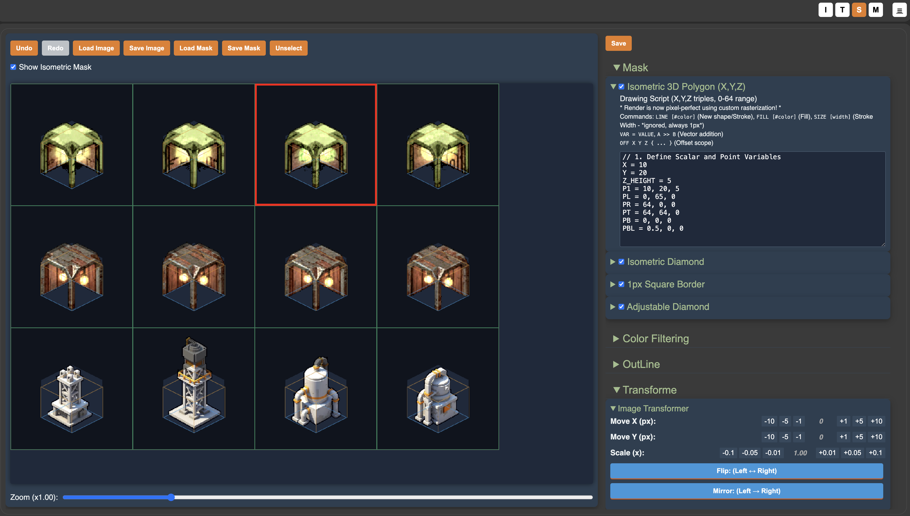
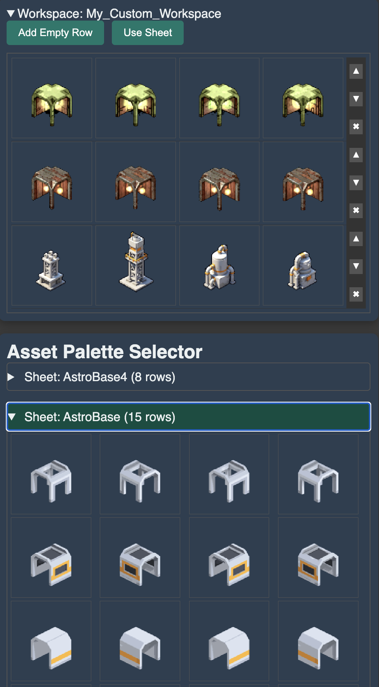
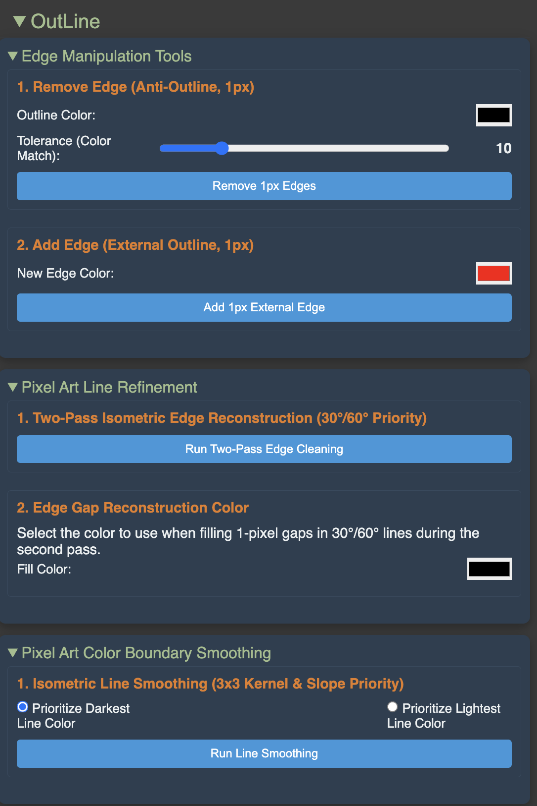
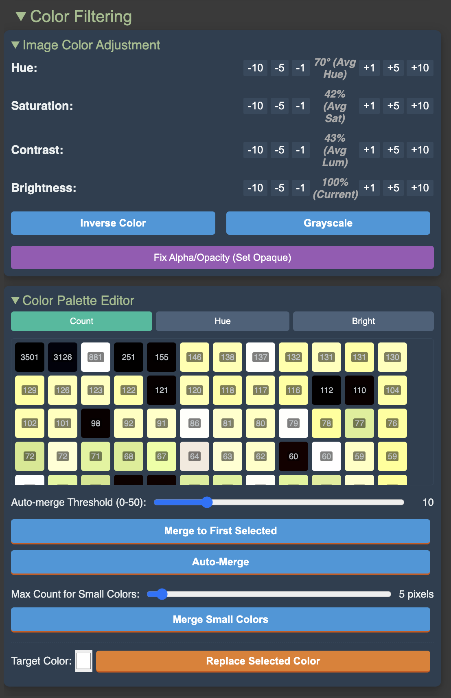
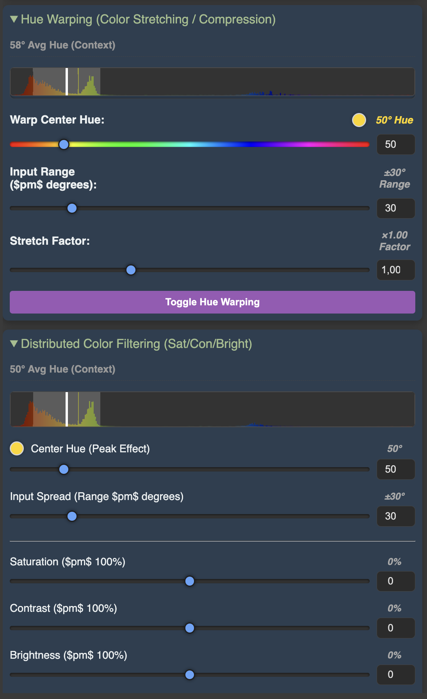

# Deno Version using TS of ZeoIso

## Run

deno run web-service

## Iso Game .

http://localhost:8081/web/indexiso.html

### Fly Veiw

### Game View

## Asset Pallet

http://localhost:8081/web/palette.html

### Overview

### Tools

